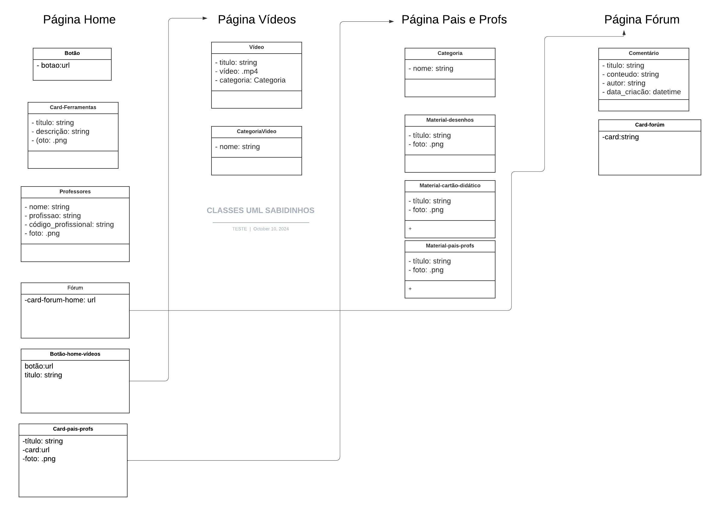

# Desafio Técnico - Projetos FRONT-END e BACK-END 24.2

## Tecnologias Utilizadas :

## Descrição do Projeto
Esse repositório tem a finalidade de realizar e documentar a parte Back-End do projeto, fazendo dinamização de classes e implementação de URL dentro do projeto.

## Como iniciar o projeto localmente:
> 1. Instalar Python 3.13.0
> 2. Criar um ambiente virtual para evitar conflitos globais no desenvolvimento.
  `python -m venv (Nome_Qualquer)`
> 3. Instalar Django 
    `pip install django`
> 4. Criar as configurações do projeto setup:
    `django-admin startproject setup`
> 5. Executar a aplicação no servidor de desenvolvimento do Django:
    `python manage.py runserver`

## Diagrama de Classes do projeto SABIDINHOS:

