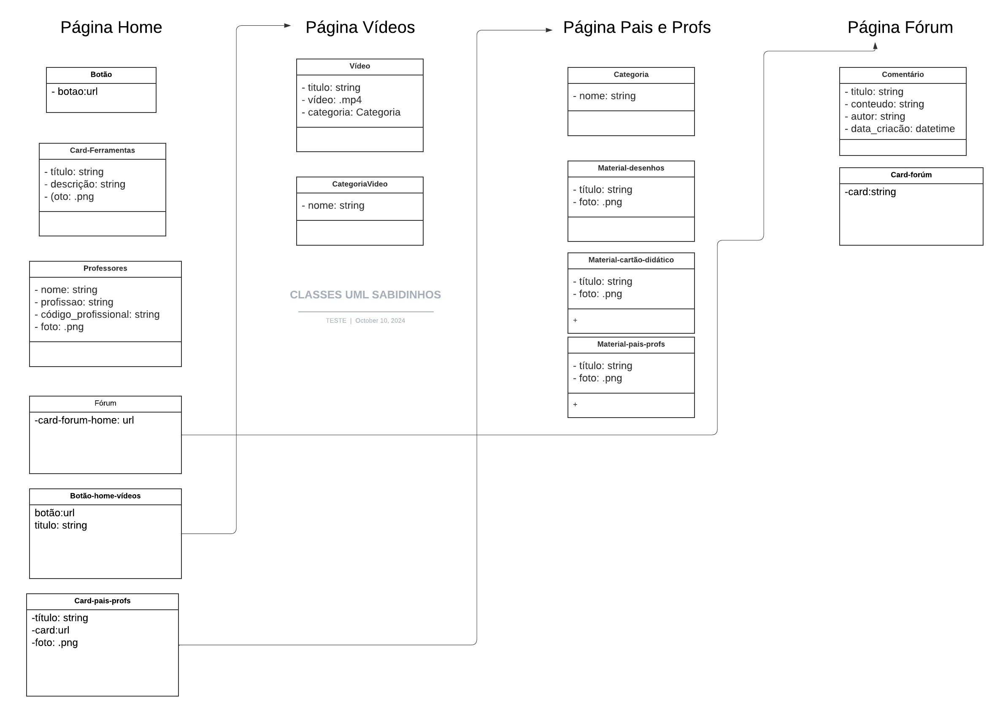

# Desafio Técnico - Projetos FRONT-END e BACK-END 24.2


## Tecnologias Utilizadas


## Descrição do Projeto
Esse projeto faz parte de um desafio para a seleção de vagas de estágio na EJECT. Ao entrar em contato com um cliente fictício, o candidato deve passar pelos processos que a empresa utiliza, incluindo reuniões de diagnóstico para entender as necessidades do cliente, elaboração do escopo e requisitos, precificação da solução, e o envio da proposta comercial. Esses processos são realizados em conjunto pela célula de projetos e as áreas de Marketing, Comercial e Financeiro.

Após a aprovação do cliente, o candidato deve alocar e coordenar uma equipe de desenvolvimento, formada por designers UX/UI e desenvolvedores front-end e back-end, para criar a solução final. No caso desse desafio, o objetivo é desenvolver tanto o front-end quanto o back-end de um site institucional para a plataforma Sabidinhos, focada em auxiliar no aprendizado de crianças. O projeto testa as habilidades dos candidatos em todas as etapas de um ciclo de desenvolvimento completo.

## Quem nós somos

| Front-end <br>[<br><sub>Filipe Campos</sub>](https://github.com/FilipeFCampos) | Front-end <br> [<br><sub>Samuel Silva</sub>](https://github.com/Samsratinho) | Front-end <br> [<br><sub>Eduarda Lourenço</sub>](https://github.com/eduardalou) | Front-end <br> [<br><sub>Luiz Felipe</sub>](https://github.com/luzdrik) | Back-end <br>[<br><sub>Gabriel Vitor</sub>](https://github.com/NewGabrielVi) | Back-end <br> [<br><sub>Arthur costa</sub>](https://github.com/arthurcostaa/) |
| :---: | :---: | :---: | :---: | :---: | :---: |

---

## Como executar o projeto

### Pré-requisitos

Para executar o projeto certifique-se que você tem uma versão recente do Python 3 instalado em sua máquina. Você pode fazer isso digitando o comando `python --version` ou `python3 --version` em seu terminal.

### Instalação e Execução

1. Clone o repositório e acesse o diretório do projeto
   ```
   git clone https://github.com/Samsratinho/Desafio-Tecnico-Projetos-BACK-END-24.2.git
   cd Desafio-Tecnico-Projetos-BACK-END-24.2
   ```
2. Crie e ative o ambiente virtual (`venv`)
   ```
   python -m venv venv
   source venv/bin/activate
   ```
3. Instale as dependências do projeto com o `pip`
   ```
   pip install -r requirements.txt
   ```
4. Execute as migrações do banco de dados
   ```
   python manage.py migrate
   ```
5. Execute o projeto
   ```
   python manage.py runserver
   ```
6. Acesse o endereço `http://127.0.0.1:8000/` no seu navegador.

## Diagrama de Classes do projeto SABIDINHOS:
